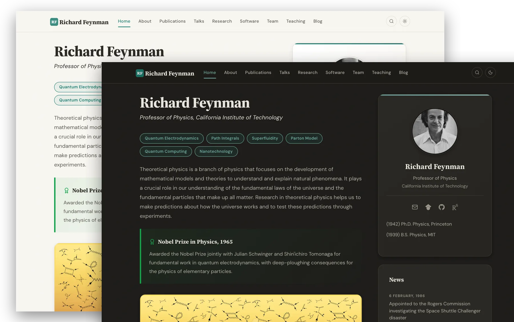
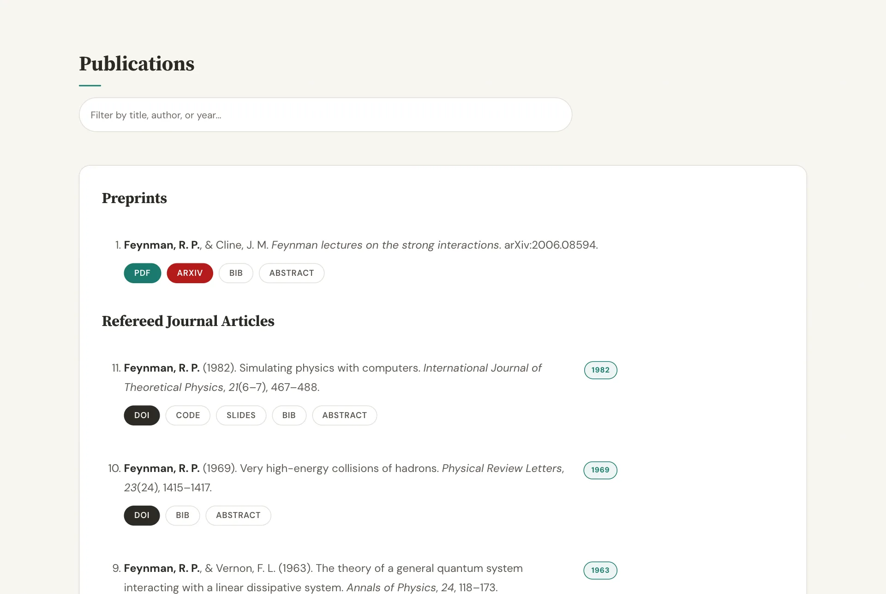
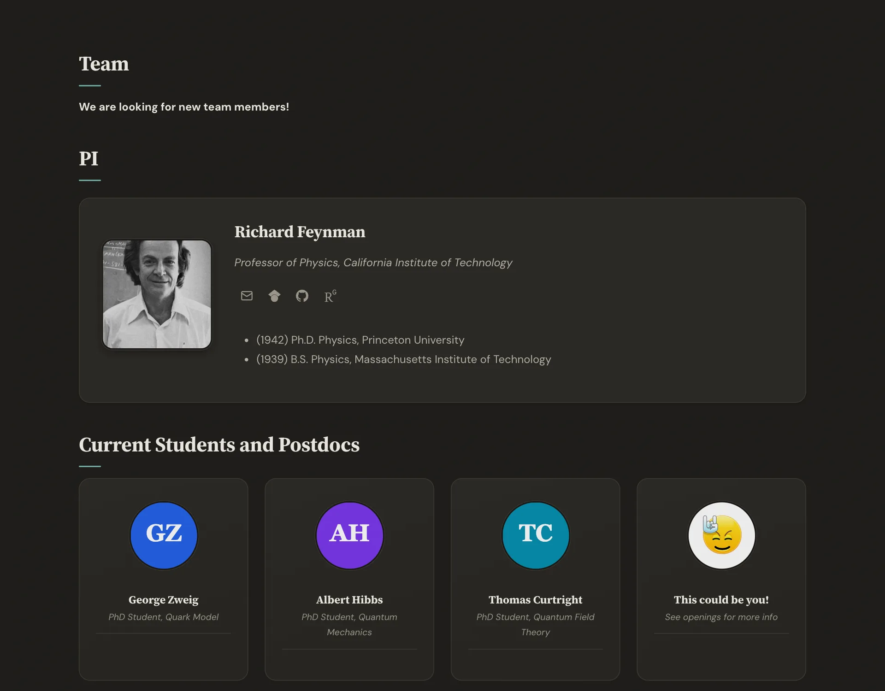
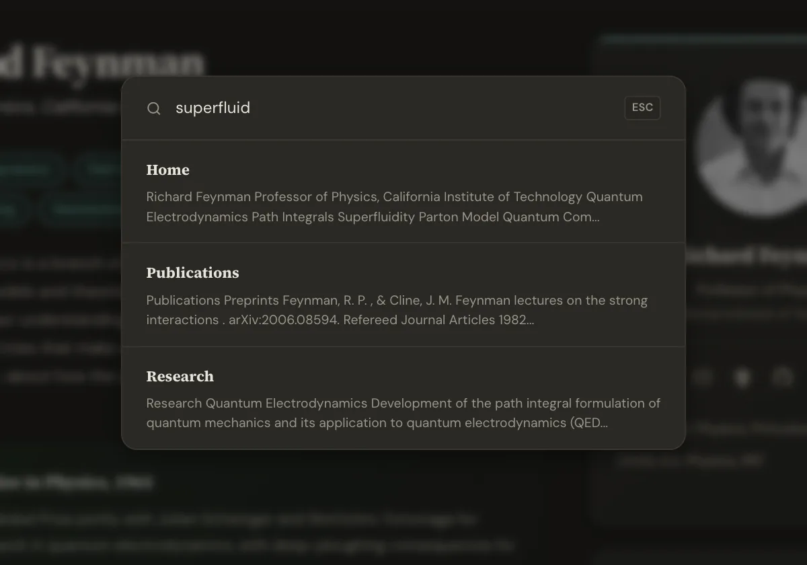

# A website template for academics

<p align="center">
  
</p>

<p align="center">
  <strong>A beautiful, production-ready Jekyll website for academics and research groups.</strong><br>
  Use the template. Fill in your info. Publish.
</p>

<p align="center">
  <a href="https://github.com/sbryngelson/academic-website-template/actions/workflows/deploy.yml"></a>
  <a href="LICENSE"></a>
</p>

<h3 align="center">
  <a href="https://sbryngelson.github.io/academic-website-template/">See the live demo &rarr;</a>
</h3>

<p align="center">
  <a href="#quick-start">Quick Start</a> &middot;
  <a href="#features">Features</a> &middot;
  <a href="#customization">Customization</a> &middot;
  <a href="#publications">Publications</a> &middot;
  <a href="#hosting">Hosting</a>
</p>

### Used by 180+ academics and research groups

<a href="https://i-vesseg.github.io/" target="_blank">★</a>
<a href="https://bczheng.com/" target="_blank">★</a>
<a href="https://bazilinskyy.github.io/" target="_blank">★</a>
<a href="https://www.coreytcallaghan.com/" target="_blank">★</a>
<a href="https://minseoksong.github.io/" target="_blank">★</a>
<a href="https://acme-group-cmu.github.io/" target="_blank">★</a>
<a href="https://adisun94.github.io/" target="_blank">★</a>
<a href="https://comp-physics.group" target="_blank">★</a>
<a href="https://spike.doc.ic.ac.uk/" target="_blank">★</a>
<a href="https://mashadab.github.io/" target="_blank">★</a>
<a href="https://home.iitk.ac.in/~lalit/" target="_blank">★</a>
<a href="https://ethan-pickering.github.io/" target="_blank">★</a>
<a href="https://pedro-dm-gomes.github.io/" target="_blank">★</a>
<a href="https://3tbk.github.io/3tbk/" target="_blank">★</a>
<a href="https://felipesua.github.io/" target="_blank">★</a>
<a href="https://shivvrat.github.io/" target="_blank">★</a>
<a href="https://ritamraha.github.io/" target="_blank">★</a>
<a href="https://matsesseldeurs.github.io/" target="_blank">★</a>
<a href="https://michelleblom.github.io/" target="_blank">★</a>
<a href="https://sahatulika15.github.io" target="_blank">★</a>
<a href="https://mzhanglab.github.io" target="_blank">★</a>
<a href="https://soar-lab.github.io" target="_blank">★</a>
<a href="https://azharghafoor.github.io/" target="_blank">★</a>
<a href="https://hyunwoo.info/" target="_blank">★</a>
<a href="https://computervision0.github.io/" target="_blank">★</a>
<a href="https://vaibhavb007.github.io/" target="_blank">★</a>
<a href="https://gabry993.github.io/" target="_blank">★</a>
<a href="https://shantnuu.github.io/" target="_blank">★</a>
<a href="https://efstathia-soufleri.github.io/" target="_blank">★</a>
<a href="https://zchoffin.github.io/" target="_blank">★</a>
<a href="https://albertgassol1.github.io/" target="_blank">★</a>
<a href="https://seanpark05.github.io/" target="_blank">★</a>
<a href="https://miki998.github.io/" target="_blank">★</a>
<a href="https://wilfonba.github.io/" target="_blank">★</a>
<a href="https://mvmacfarlane.github.io/" target="_blank">★</a>
<a href="https://saharnaz.org/" target="_blank">★</a>
<a href="https://www.isnicholas.com/" target="_blank">★</a>
<a href="https://zhiyu7.github.io/" target="_blank">★</a>
<a href="https://awen-li.github.io/" target="_blank">★</a>
<a href="https://yukiiwong.github.io/" target="_blank">★</a>
<a href="https://joeyleehk.github.io/" target="_blank">★</a>
<a href="https://fabayocbocjr.github.io/" target="_blank">★</a>
<a href="https://adityanandy.github.io/" target="_blank">★</a>
<a href="https://jlastro.github.io/" target="_blank">★</a>
<a href="https://xia-hu.github.io/" target="_blank">★</a>
<a href="https://p-bajpai.github.io/" target="_blank">★</a>
<a href="https://AdityaSinghDevs.github.io/" target="_blank">★</a>
<a href="https://aipsita.github.io/" target="_blank">★</a>
<a href="https://anedelin.github.io/" target="_blank">★</a>
<a href="https://avibagchi.github.io/" target="_blank">★</a>
<a href="https://binbin-xie.github.io/" target="_blank">★</a>
<a href="https://BiomedLabUGgt.github.io/" target="_blank">★</a>
<a href="https://emilyvansyoc.github.io/" target="_blank">★</a>
<a href="https://Erd-ling.github.io/" target="_blank">★</a>
<a href="https://estimation-control-learning-laboratory.github.io/" target="_blank">★</a>
<a href="https://EthanJ666.github.io/" target="_blank">★</a>
<a href="https://f-farhan.github.io/" target="_blank">★</a>
<a href="https://gcg-helsinki.github.io/" target="_blank">★</a>
<a href="https://Grupo-MATE.github.io/" target="_blank">★</a>
<a href="https://guancai.github.io/" target="_blank">★</a>
<a href="https://haochey.github.io/" target="_blank">★</a>
<a href="https://hrositi.github.io/" target="_blank">★</a>
<a href="https://Khris-VI.github.io/" target="_blank">★</a>
<a href="https://KieuTruong.github.io/" target="_blank">★</a>
<a href="https://kwakkyoleen.github.io/" target="_blank">★</a>
<a href="https://martinezach.github.io/" target="_blank">★</a>
<a href="https://msstate-athena.github.io/" target="_blank">★</a>
<a href="https://mvanwyngarden.github.io/" target="_blank">★</a>
<a href="https://Naeele.github.io/" target="_blank">★</a>
<a href="https://NickJi98.github.io/" target="_blank">★</a>
<a href="https://qianhuimen.github.io/" target="_blank">★</a>
<a href="https://saorisakaue.github.io/" target="_blank">★</a>
<a href="https://victorolaiya.github.io/" target="_blank">★</a>
<a href="https://wjin4.github.io/" target="_blank">★</a>
<a href="https://yasserfarouk.github.io/" target="_blank">★</a>
<a href="https://yuminglab.github.io/" target="_blank">★</a>
<a href="https://zeyuD.github.io/" target="_blank">★</a>
<a href="https://nderus.github.io" target="_blank">★</a>
<a href="https://1781950192.github.io/zjgsu.lch/" target="_blank">★</a>
<a href="https://9laurence.github.io/" target="_blank">★</a>
<a href="https://abhilekhborah.github.io/abhilekhborah123.github.io/" target="_blank">★</a>
<a href="https://AGB-Shargh.github.io/" target="_blank">★</a>
<a href="https://aidanrm.com/" target="_blank">★</a>
<a href="https://albertopadovan.github.io/apgroup/" target="_blank">★</a>
<a href="https://ali-ayati.com/" target="_blank">★</a>
<a href="https://AliciaNegre.github.io/" target="_blank">★</a>
<a href="https://Amanita19.github.io/" target="_blank">★</a>
<a href="https://aniksh.github.io/" target="_blank">★</a>
<a href="https://AyahHelal.github.io/" target="_blank">★</a>
<a href="https://b-mahato.github.io/" target="_blank">★</a>
<a href="https://bcolmey.github.io/" target="_blank">★</a>
<a href="https://braden-kennedy.github.io/bkennedyportfolio/" target="_blank">★</a>
<a href="https://bwangair.github.io/" target="_blank">★</a>
<a href="https://C-3PE.github.io/" target="_blank">★</a>
<a href="https://carmenreal.github.io/" target="_blank">★</a>
<a href="https://chlookaburra.github.io/" target="_blank">★</a>
<a href="https://chris-hzc.github.io/" target="_blank">★</a>
<a href="https://chz05.github.io/" target="_blank">★</a>
<a href="https://DanielEWeeks.github.io/Daniel_E_Weeks/" target="_blank">★</a>
<a href="https://www.danieljvickers.com/" target="_blank">★</a>
<a href="https://deepaktatachar.github.io/" target="_blank">★</a>
<a href="https://DGonzalezPicos.github.io/" target="_blank">★</a>
<a href="https://dmebr.com/" target="_blank">★</a>
<a href="https://DominikSlomma.github.io/" target="_blank">★</a>
<a href="https://ecsicl.github.io/" target="_blank">★</a>
<a href="https://egl49.github.io/" target="_blank">★</a>
<a href="https://eletoo.github.io/" target="_blank">★</a>
<a href="https://ericmanley.github.io/" target="_blank">★</a>
<a href="https://Fanerst.github.io/" target="_blank">★</a>
<a href="https://www.fintanhealy.co.uk/" target="_blank">★</a>
<a href="https://flampouris.com/" target="_blank">★</a>
<a href="https://gabriel-correa.com/" target="_blank">★</a>
<a href="https://Gaby-253.github.io/" target="_blank">★</a>
<a href="https://HaiboLi99.github.io/" target="_blank">★</a>
<a href="https://HC-teemo.github.io/grapheco.github.io/" target="_blank">★</a>
<a href="https://hcfun.github.io/" target="_blank">★</a>
<a href="https://hikari-NYU.github.io/" target="_blank">★</a>
<a href="https://hildaadwubiosei.github.io/hildaosei/" target="_blank">★</a>
<a href="https://IlianaXn.github.io/" target="_blank">★</a>
<a href="https://jadededaj.github.io/" target="_blank">★</a>
<a href="https://jessestraat.github.io/" target="_blank">★</a>
<a href="https://jiaenwu.github.io/jiaenwu/" target="_blank">★</a>
<a href="https://JialiangTang.github.io/homepage/" target="_blank">★</a>
<a href="https://Jill0099.github.io/" target="_blank">★</a>
<a href="https://JohanSGV.github.io/" target="_blank">★</a>
<a href="https://juang.id/" target="_blank">★</a>
<a href="https://julianklix.github.io/" target="_blank">★</a>
<a href="https://Julien-Co.github.io/" target="_blank">★</a>
<a href="https://JWM-CU.github.io/mmc3/" target="_blank">★</a>
<a href="https://kacf24.github.io/" target="_blank">★</a>
<a href="https://kalfton.github.io/" target="_blank">★</a>
<a href="https://Kilomaroon.github.io/" target="_blank">★</a>
<a href="https://LHCb-Cincinnati.github.io/" target="_blank">★</a>
<a href="https://lorenzoghiro.com/" target="_blank">★</a>
<a href="https://Lspor.github.io/Lauren_Spor/" target="_blank">★</a>
<a href="https://lucasSaavedra123.github.io/" target="_blank">★</a>
<a href="https://lukasztychoniec.github.io/" target="_blank">★</a>
<a href="https://majinwakeup.github.io/" target="_blank">★</a>
<a href="https://margaretmurakami.github.io/" target="_blank">★</a>
<a href="https://MaxDYF.github.io/" target="_blank">★</a>
<a href="https://mekhiito.github.io/" target="_blank">★</a>
<a href="https://mgoldberg10.github.io/" target="_blank">★</a>
<a href="https://MosesStewart.github.io/" target="_blank">★</a>
<a href="https://mxyao.github.io/" target="_blank">★</a>
<a href="https://NaokiItsui.github.io/" target="_blank">★</a>
<a href="https://owenarden.github.io/home/" target="_blank">★</a>
<a href="https://pinakisar.github.io/" target="_blank">★</a>
<a href="https://pponzio.github.io/" target="_blank">★</a>
<a href="https://www.quant-minds.com/" target="_blank">★</a>
<a href="https://Qxjyqzw.github.io/" target="_blank">★</a>
<a href="https://rajmadan96.github.io/website/" target="_blank">★</a>
<a href="https://rgrinnovatellc.github.io/" target="_blank">★</a>
<a href="https://richardhchen.com/" target="_blank">★</a>
<a href="https://riqx-code.github.io/rithi/" target="_blank">★</a>
<a href="https://riveralab.org/" target="_blank">★</a>
<a href="https://robotcodelab.com/" target="_blank">★</a>
<a href="https://rosalab.github.io/" target="_blank">★</a>
<a href="https://s-shailja.github.io/website/" target="_blank">★</a>
<a href="https://saauan.github.io/" target="_blank">★</a>
<a href="https://Saif2098.github.io/" target="_blank">★</a>
<a href="https://SarveshVGharat.github.io/" target="_blank">★</a>
<a href="https://sliao7.github.io/home/" target="_blank">★</a>
<a href="https://sms-lab.github.io/" target="_blank">★</a>
<a href="https://snapcoalition.org/" target="_blank">★</a>
<a href="https://speciation-genomics.github.io/" target="_blank">★</a>
<a href="https://stephanbickel.com/" target="_blank">★</a>
<a href="https://suruoxin.github.io/" target="_blank">★</a>
<a href="https://sxswz213.github.io/" target="_blank">★</a>
<a href="https://t3humphries.github.io/" target="_blank">★</a>
<a href="https://tadeuszrudek.github.io/" target="_blank">★</a>
<a href="https://Takumi-Kijima.github.io/" target="_blank">★</a>
<a href="https://tic173.github.io/TianyiChu/" target="_blank">★</a>
<a href="https://umbertomuratori.github.io/" target="_blank">★</a>
<a href="https://USTC-Xu-Group.github.io/" target="_blank">★</a>
<a href="https://vinkoyang.github.io/VinkoYang/" target="_blank">★</a>
<a href="https://voilalab.github.io/" target="_blank">★</a>
<a href="https://wakandaai.github.io/" target="_blank">★</a>
<a href="https://WenbinLuomath.github.io/wenbinluo/" target="_blank">★</a>
<a href="https://xietian1.github.io/snms-lab-web/" target="_blank">★</a>
<a href="https://xiuquan0418.github.io/" target="_blank">★</a>
<a href="https://xuguangning1218.github.io/" target="_blank">★</a>
<a href="https://xzzhouxi.github.io/xzzhouxi.github.com/" target="_blank">★</a>
<a href="https://YongPeng25.github.io/WaveLens/" target="_blank">★</a>
<a href="https://YueGroup.github.io/" target="_blank">★</a>
<a href="https://zcy26.github.io/" target="_blank">★</a>

Each star is a live site built from this template. The list is re-checked now and then; sites that go offline or move to another template are removed.

__Using this template? Share your site and I'll add it here!__

---

## Features

### Design
- **Source Serif 4 + DM Sans** typography — elegant serif headings paired with a clean geometric sans body, self-hosted (no Google Fonts requests)
- **Warm parchment palette** with subtle noise texture for depth, not flat generic whites
- **Dark mode** — toggle in navbar, auto-detects system preference, persists across visits
- **Frosted glass navbar** with backdrop blur, active page indicator, and scroll shadow
- **Dynamic favicon** — SVG generated from your initials + accent color; ICO and Apple touch icon rasterized from it at deploy time
- **Responsive** — CSS Grid layouts that adapt from desktop to tablet to mobile
- **Print stylesheet** — printing or saving a page as PDF gives white paper, no navigation, and references with their DOI/arXiv URLs spelled out

### Interactions
- **Site-wide search** — press `Cmd+K` (or `Ctrl+K`) to instantly search all pages
- **Copy BibTeX** — hover any bibtex block to reveal a one-click copy button
- **Animated link underlines** — smooth gradient underlines that grow on hover
- **Card hover effects** — lift + shadow on team cards, research cards, and profile photo
- **Image zoom** — subtle scale on hover for team photos, research thumbnails, and the banner
- **Back-to-top button** — appears on scroll, smooth scrolls up
- **Smooth expand/collapse** — CSS transitions on publication abstracts and BibTeX entries

### Publications
- **Auto-generated from BibTeX** via Jekyll Scholar — just edit `assets/ref.bib`
- **Search bar** — filter publications by title, author, or year
- **Year badges** — small accent-colored pills for quick scanning
- **Pill buttons** — PDF, DOI, arXiv, Link, Code, Slides, Video, Poster, Data, BIB, Abstract, all driven by BibTeX fields
- **Selected publications** on the home page — add `selected={true}` to an entry

### For New Users
- **Interactive setup script** — `./setup.sh` fills in your name, title, and institution; `./setup.sh --clean` also strips the demo content
- **Talks, teaching, and software as data** — edit a YAML list, not HTML
- **5-step `_config.yml`** — numbered sections with inline comments guide you through setup
- **Well-commented data files** — every field in `_data/*.yml` is explained with examples
- **Analytics, your choice** — Google Analytics, Plausible, Umami, or GoatCounter, each a one-line setting
- **Smart link handling** — empty links in config are automatically hidden (no broken icons)

### Technical
- **Modular SASS** — organized into `base/`, `components/`, `layouts/`, `utilities/`
- **No third-party requests** — fonts and icons are served from your own site; the only external script is MathJax, and only on pages that opt in
- **Selective Bootstrap 5.3.8 SCSS** — navbar, reboot and utilities only; no Bootstrap JavaScript, no jQuery
- **Single dependency-free JS file** — dark mode, search, toggles, scroll effects, copy button
- **Auto-generated sitemap** via `jekyll-sitemap`
- **Reproducible builds** — `Gemfile.lock` is committed, so your site builds the same way next year
- **CI on pull requests** — every PR is built and its internal links are checked
- **Open Graph + Twitter Cards** — links look good when shared on social media
- **MathJax 4** — add `math: true` to a page or post (or set it site-wide in `_config.yml`)

## Screenshots

| | |
|:---:|:---:|
|  |  |
| Publications: filter box, year badges, buttons from BibTeX fields | Team page with card grid (dark mode) |
|  | |
| Site-wide search (Cmd+K) | |

## Quick Start

1. Click **[Use this template](https://github.com/sbryngelson/academic-website-template/generate)** and name the new repository `YOUR_USERNAME.github.io`
   (prefer this over forking: you get a clean history, no upstream baggage, and the option to keep it private)
2. **Install** Ruby and Bundler ([Jekyll's guide](https://jekyllrb.com/docs/installation/) covers it), then run `bundle install`
3. **Configure** your site:
   ```bash
   ./setup.sh --clean  # remove the demo content and fill in your details, or
   ./setup.sh          # keep the demo content as examples, or
   vim _config.yml     # edit Steps 1-5 directly
   ```
4. **Add your publications** to `assets/ref.bib`
5. **Customize** data files in `_data/` (team members, news, awards, etc.)
6. **Preview** your site:
   ```bash
   bundle exec jekyll serve
   # open http://localhost:4000
   ```
7. **Deploy**: push to GitHub, then once, in your repo, set **Settings > Pages > Source** to **GitHub Actions**. Every later push deploys automatically.

## Detailed How-To Guide

### Step 1: Create Your Repository

Click **[Use this template](https://github.com/sbryngelson/academic-website-template/generate)** on GitHub and name the new repository `YOUR_USERNAME.github.io`. Then clone it:

```bash
git clone https://github.com/YOUR_USERNAME/YOUR_USERNAME.github.io.git
cd YOUR_USERNAME.github.io
```


### Step 2: Install Dependencies

You need Ruby (3.2 or newer; the deploy workflow uses 4.0) and Bundler. See [Jekyll's installation guide](https://jekyllrb.com/docs/installation/).

```bash
bundle install
```

### Step 3: Configure Your Identity

Open `_config.yml` and fill in your information. The file is organized into numbered steps:

```yaml
# STEP 1: Your Identity
name: "Jane Smith"
title: "Assistant Professor of Computer Science"
institution: "Stanford University"
email: jsmith@stanford.edu
photo: headshot.jpg   # place your photo in images/
```

Or run the interactive setup script:

```bash
./setup.sh          # prompts for name, title, institution, email
./setup.sh --clean  # same, after removing the demo content
```

`--clean` asks for confirmation, then empties the data files (keeping their field comments), `assets/ref.bib`, `_posts/`, `papers/`, the demo team and research images, and the Feynman prose in `home.md`, `research.md`, and `team.md`, and points `photo` at a placeholder avatar.

### Step 4: Add Your Links

Still in `_config.yml`, add your academic profiles. Leave blank (or delete) any you don't use:

```yaml
# STEP 2: Your Links
links:
  google_scholar: "https://scholar.google.com/citations?user=YOUR_ID"
  github: "https://github.com/yourusername"
  orcid: "https://orcid.org/0000-0000-0000-0000"
  cv: "papers/cv.pdf"        # place your CV in the papers/ directory
  twitter: ""                # leave blank to hide
  linkedin: ""
```

### Step 5: Add Your Photo

Place your profile photo in the `images/` directory. Update the `photo` field in `_config.yml` to match the filename.

### Step 6: Add Publications

Edit `assets/ref.bib` with your BibTeX entries. The publications page is auto-generated. Example:

```bibtex
@article{smith2024,
  author = {Smith, Jane and Doe, John},
  title = {A Novel Approach to Machine Learning},
  journal = {Nature},
  year = {2024},
  volume = {42},
  pages = {1--10},
  doi = {10.1234/example},
  arxiv = {2401.01234},
  code = {https://github.com/jsmith/novel-approach},
  file = {smith2024.pdf},       % place PDF in papers/
  selected = {true},            % also show on the home page
  abstract = {We present...}
}
```

Every link is a BibTeX field; use the ones you have:

| Field | Button |
|-------|--------|
| `file` | PDF (file in `papers/`) |
| `doi`, `arxiv`, `url` | DOI, arXiv, Link |
| `code`, `slides`, `video`, `poster`, `data` | Code, Slides, Video, Poster, Data |
| `abstract` | Abstract (expandable) |
| `selected = {true}` | Listed under "Selected publications" on the home page |

Your name is bolded automatically in the publication list. Set it in `_config.yml` exactly as it appears in the rendered list (`Last, F. M.`), longest form first:

```yaml
scholar:
  last_name: Smith
  first_name: ["J. A.", "J."]
```

### Step 7: Add Team Members

Edit `_data/team_members.yml`:

```yaml
- name: Alice Johnson
  photo: alice.jpg          # place in images/ or images/team/
  info: PhD Student, started Fall 2023
  email: alice@university.edu
  website: https://alice.dev
  github: https://github.com/alice
```

### Step 8: Add News

Edit `_data/news.yml` (newest first):

```yaml
- date: 15 March, 2024
  headline: "Our paper on X was accepted to NeurIPS!"

- date: 1 January, 2024
  headline: "Welcome to new PhD student Alice Johnson"
```

### Step 9: Customize Pages

Each page in `_pages/` is a Markdown file. Edit the content directly:

- `home.md` — your welcome text and bio (see [Home page building blocks](#home-page-building-blocks))
- `research.md` — describe your research areas
- `about.md` — optional sections (grants, awards, sponsors) driven by `_data/`
- `team.md` — the openings note and administrative contact

Talks, teaching, and software are lists in `_data/` (see below); their pages need no editing.

To remove a page from the navbar, comment it out in `_config.yml`:

```yaml
nav_pages:
  - name: about
  - name: publications
    label: Papers        # optional: navbar text (URL stays /publications)
  # - name: talks        # hidden from navbar
  - name: research
```

Blog posts live in `_posts/` and are published at `/blog/<year>/<title>/`.

### Step 10: Preview and Deploy

```bash
# Preview locally
bundle exec jekyll serve
# Visit http://localhost:4000

# When ready, push to GitHub
git add -A
git commit -m "My academic website"
git push
```

A GitHub Actions workflow automatically builds and deploys your site on every push. Make sure to go to **Settings > Pages > Source** in your repo and select **GitHub Actions**.

Your site will be live at `https://YOUR_USERNAME.github.io` within a few minutes.

---

## Customization

### _config.yml

The config file is organized into 5 numbered steps:

| Step | Section | What to fill in |
|------|---------|-----------------|
| 1 | **Your Identity** | Name, title, institution, email, photo |
| 2 | **Your Links** | Google Scholar, GitHub, ORCID, Twitter, LinkedIn, CV |
| 3 | **Site Settings** | Accent color, dark mode, math, analytics (GA4, Plausible, Umami, GoatCounter) |
| 4 | **Your Pages** | Comment out any pages you don't need |
| 5 | **Publications** | Your name (for bolding) and Jekyll Scholar options |

### Data Files

| File | Purpose |
|------|---------|
| `_data/team_members.yml` | Current students and postdocs |
| `_data/alumni.yml` | Former lab members |
| `_data/news.yml` | News items (3 most recent shown on home) |
| `_data/awards.yml` | Awards and honors |
| `_data/grants.yml` | Grants and funding |
| `_data/funders.yml` | Funder logos |
| `_data/talks.yml` | Invited and contributed talks |
| `_data/teaching.yml` | Courses |
| `_data/software.yml` | Software projects |
| `_data/pi.yml` | Optional: detailed education for About page |

Each file has inline comments explaining every field. Entries marked `# EXAMPLE` should be replaced or deleted.

### Pages

All pages are in `_pages/`. Edit the Markdown content directly. Pages use the `page` layout; blog posts use `post`.

### Accent Color & Dark Mode

Set `accent_color` in `_config.yml` to change the theme color across the entire site (links, buttons, highlights, favicon). Light and dark mode variants are derived from it automatically. Set `dark_mode: false` to disable dark mode entirely.

### CSS & JS Customization

The site uses modular SASS in `_sass/`:

```
_sass/
  base/          # variables, fonts, typography, icons, reset
  components/    # card, chips, navbar, buttons, footer, profile, publication, search
  layouts/       # home grid, team grid, research grid
  utilities/     # dark mode, animations, print
```

For JavaScript, edit `assets/js/site.js` directly. There is no build step.

### Home page building blocks

`home.md` uses three optional blocks you can copy, reorder, or delete:

```html
<!-- Research-area chips (link to /research) -->
<div class="chip-container" markdown="0">
<a href="{{ '/research' | relative_url }}" class="chip">Quantum Electrodynamics</a>
<a href="{{ '/research' | relative_url }}" class="chip">Superfluidity</a>
</div>

<!-- Callout box: callout-success, callout-warning, or callout-info -->
<div class="callout callout-success" markdown="0">
<div class="callout-title"> Nobel Prize in Physics, 1965</div>
<p>One or two sentences.</p>
</div>

<!-- Banner image with caption; place the image in images/ -->
<div class="banner-frame" markdown="0">

<div class="banner-caption">Caption text</div>
</div>
```

### Search

Every page and blog post is indexed for the Cmd+K search at build time. Add `search: false` to a page's front matter to leave it out.

### Icons

Icons are inline SVG symbols in `_includes/icons.svg` (Simple Icons, Lucide, Bootstrap Icons). Use one with:

```liquid

```

To add an icon, paste its path data into a new `<symbol id="icon-NAME" viewBox="...">` in that file.

### Math

MathJax is loaded only where it is needed. Add `math: true` to the front matter of any page or post that contains LaTeX, or set `math: true` in `_config.yml` to load it everywhere.

## Publications

Publications are generated from `assets/ref.bib` by [Jekyll Scholar](https://github.com/inukshuk/jekyll-scholar); see [Step 6](#step-6-add-publications) for the supported fields and name bolding.

## Hosting

### GitHub Pages

Create your repo from this template as `your_username.github.io` and push. A **GitHub Actions workflow** is included (`.github/workflows/deploy.yml`) that automatically builds the site with Jekyll Scholar and deploys to GitHub Pages on every push to `source`.

One-time setup: go to your repo's **Settings > Pages > Source** and select **GitHub Actions** instead of "Deploy from a branch". (GitHub does not let a workflow enable Pages on its own; until you do this, the deploy step will fail with a message saying so.)

### Custom Domain

Purchase a domain, enter it under **Settings > Pages > Custom domain**, and configure DNS; the workflow picks up the new URL automatically. See [GitHub's guide](https://docs.github.com/en/pages/configuring-a-custom-domain-for-your-github-pages-site). (Sites deployed with GitHub Actions configure the domain in Settings, not with a `CNAME` file.)

### Self-Hosting

Set `url` (and `baseurl` if the site lives in a sub-path) in `_config.yml`, build with `JEKYLL_ENV=production bundle exec jekyll build`, and upload `_site/` to your server.

## Troubleshooting

| Symptom | Cause and fix |
|---|---|
| The deploy workflow fails at "Configure Pages" | Pages is not enabled for GitHub Actions yet. Settings > Pages > Source > **GitHub Actions** (one time). |
| Site builds locally but pages 404 on GitHub | Push to the `source` branch; the workflow only deploys from there. Check the Actions tab for the run. |
| My name is not bold in the publication list | `scholar.first_name` must match the rendered initials exactly, e.g. `["J. A.", "J."]`, longest form first. |
| `bundle install` fails on macOS | The system Ruby is too old or read-only. Install Ruby 3.2+ with Homebrew, rbenv, or mise, then rerun. |
| A page is missing from Cmd+K search | Pages need a `title` in their front matter; `search: false` excludes a page on purpose. |
| Equations do not render | Add `math: true` to that page's front matter, or `math: true` in `_config.yml`. |

## Upgrading

Coming from the previous version? See [UPGRADING.md](UPGRADING.md).

## Alternatives

* [al-folio](https://github.com/alshedivat/al-folio)
* [academicpages](https://academicpages.github.io/)
* [Minimal Mistakes](https://mmistakes.github.io/minimal-mistakes/)

## License

MIT
